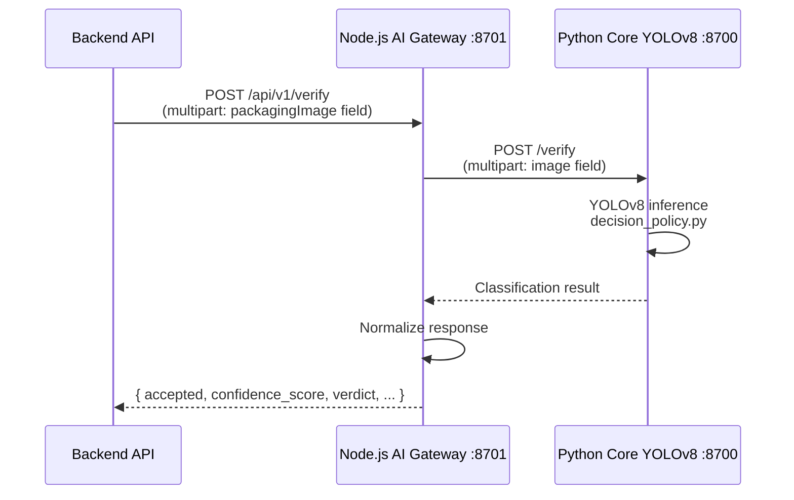

# AI Verification Service

Packaging appearance verification service using YOLOv8 to detect counterfeit drug packaging.

## Architecture



- **Node.js Gateway** (`ai-service/`): request validation, timeout, structured logging, response normalization.
- **Python Core** (`ai-service/python-core/`): stateless YOLOv8 inference runtime, receives and returns multipart or JSON.
- **Model**: `ai-service/models/best.pt` — YOLOv8 weights file, mounted read-only into the container.

---

## Key Guarantees

- Verify endpoint accepts one multipart image field named `image`.
- Response always includes `accepted`, `confidence_score`, and `verdict`.
- Default decision thresholds for regulated supply-chain screening:
  - `AI_CONFIDENCE_THRESHOLD=0.5`
  - `AI_COUNTERFEIT_MIN_SCORE=0.6`
  - `AI_AUTHENTIC_MIN_SCORE=0.75`
- Backend integrates in **fail-open** mode by default: if the AI service is unavailable, the verification flow continues without AI result.

---

## API

| Method | Path | Description |
|--------|------|-------------|
| `GET` | `/health` | Health probe for orchestration |
| `POST` | `/api/v1/verify` | Analyse one packaging image |

Full OpenAPI spec: [`swagger.yaml`](swagger.yaml)

---

## Verify Response Example

```json
{
  "accepted": false,
  "is_authentic": false,
  "confidence_score": 0.81,
  "verdict": "SUSPICIOUS",
  "decision_reason": "counterfeit_signal_detected",
  "counterfeit_min_score": 0.6,
  "authentic_min_score": 0.75,
  "counterfeit_score": 0.81,
  "authentic_score": 0.22,
  "detections": [
    {
      "label": "counterfeit",
      "confidence": 0.81,
      "bbox": [102.4, 88.1, 560.2, 690.7]
    }
  ],
  "model_path": "/models/best.pt",
  "latency_ms": 38.4
}
```

---

## Model File Setup

> **Required**: `best.pt` is not committed to the repository due to file size.

```bash
# Place the weights file in the expected location
cp /path/to/best.pt ai-service/models/best.pt
```

Model sources:
- Colab training notebook: [DrugDetect Colab](https://colab.research.google.com/drive/1G1wb-Ey-QxtFyHttCPUBxQZorBoYFYMG)
- HuggingFace Space: [tranhungquoc/DrugDetect](https://huggingface.co/spaces/tranhungquoc/DrugDetect)
- Dataset: [Medicine Logo Detection — Roboflow](https://universe.roboflow.com/medicine-logo-classification/medicine-logo-detection/dataset/2)

---

## Local Development

Node.js gateway:

```bash
cd ai-service
npm install
npm run dev
```

Python core (separate terminal):

```bash
cd ai-service/python-core
python -m venv .venv
source .venv/bin/activate
pip install -r requirements.txt
uvicorn app:app --host 0.0.0.0 --port 8700
```

Or run the full stack via Docker Compose from repository root:

```bash
./scripts/run-all.sh up
```

---

## Tests

```bash
# Node.js gateway unit tests
cd ai-service && npm test

# Python decision policy tests
cd ai-service && npm run test:policy
```

---

## Environment Variables

### Node.js Gateway (`ai-service/.env`)

| Variable | Required | Default | Description |
|----------|----------|---------|-------------|
| `PORT` | Yes | `8701` | Node API port |
| `PYTHON_SERVICE_URL` | Yes | `http://localhost:8700` | Python core base URL |
| `LOG_LEVEL` | No | `info` | Log level |
| `REQUEST_TIMEOUT_MS` | No | `10000` | Timeout for Node → Python calls |

### Python Core

| Variable | Required | Default | Description |
|----------|----------|---------|-------------|
| `AI_MODEL_PATH` | Yes | `/models/best.pt` | YOLOv8 weights path |
| `AI_INFERENCE_DEVICE` | No | `cpu` | Inference device (`cpu`, `mps`, `cuda:0`) |
| `AI_CONFIDENCE_THRESHOLD` | No | `0.5` | Minimum detection confidence |
| `AI_COUNTERFEIT_MIN_SCORE` | No | `0.6` | Minimum score to flag as counterfeit |
| `AI_AUTHENTIC_MIN_SCORE` | No | `0.75` | Minimum score required to accept as authentic |
| `AI_COUNTERFEIT_LABELS` | No | `counterfeit,fake,gia` | Comma-separated counterfeit class labels |
| `AI_AUTHENTIC_LABELS` | No | `authentic,genuine,real` | Comma-separated authentic class labels |

---

## Backend Integration

The backend activates the AI verification lane when:
- `AI_VERIFICATION_ENABLED=true` (backend environment variable)
- The `/verify` request includes a `packagingImage` multipart field

If the AI service is unavailable and `AI_VERIFICATION_FAIL_OPEN=true` (default), the verification flow proceeds without an AI result.

See: [`docs/backend/integration-contract.md`](../backend/integration-contract.md)
