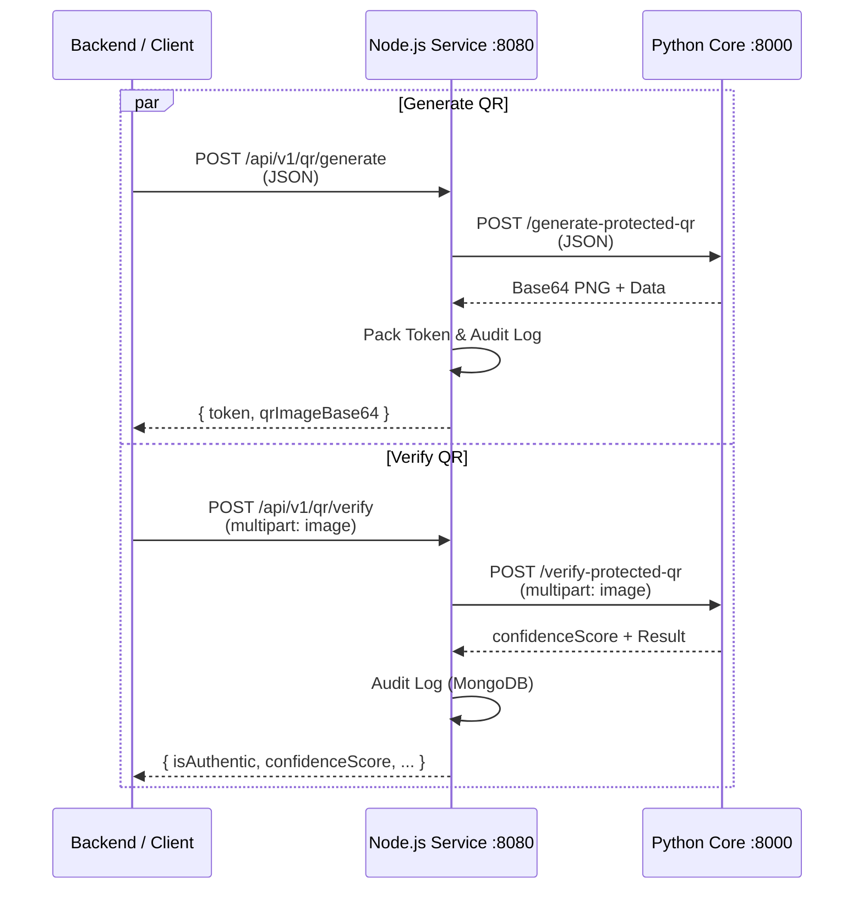

# Protected QR Service

Fixed-geometry, copy-sensitive QR generator and verifier for pharmaceutical anti-counterfeit workflows.

## How It Works

The service embeds a unique center pattern into a standard QR code that acts as a physical-digital fingerprint. A standard QR can be trivially cloned; a Protected QR's center pattern degrades detectably when photocopied or re-printed, allowing the Python verifier to distinguish authentic originals from copies using confidence scores.

## Architecture



- **Node.js Service** (`protected-qr/`): request validation, HMAC token signing, audit log, MongoDB persistence.
- **Python Core** (`protected-qr/python-core/`): stateless QR generation and center-pattern verification using image processing.
- **MongoDB**: stores audit records and verification history for compliance.

---

## Key Guarantees

- QR payload is fixed at 34 bytes.
- Token format: `Base64Url(48 bytes) + "." + HMAC-SHA256(32 bytes)` — approximately 81 characters.
- Output QR image: 600×600 px, border=1, Error Correction Level H.
- Center pattern crop used for verification: 154×154 px.
- Verification thresholds: `authentic > 0.70`, `fake < 0.55` — values in between go to `REVIEW_REQUIRED`.

---

## API

| Method | Path | Description |
|--------|------|-------------|
| `GET` | `/health` | Health probe |
| `POST` | `/api/v1/qr/generate` | Generate Protected QR and HMAC token |
| `POST` | `/api/v1/qr/verify` | Verify a scanned QR image |

Full OpenAPI spec: [`swagger.yaml`](swagger.yaml)

---

## Hex Input Format (Generate)

All input fields must be fixed-length hex strings:

| Field | Length | Example |
|-------|--------|---------|
| `dataHash` | 8 hex chars (4 bytes) | `a1b2c3d4` |
| `metadataSeries` | 16 hex chars (8 bytes) | `1234567890abcdef` |
| `metadataIssued` | 16 hex chars (8 bytes) | `0011223344556677` |
| `metadataExpiry` | 16 hex chars (8 bytes) | `8899aabbccddeeff` |

### Generate Request

```json
{
  "dataHash": "a1b2c3d4",
  "metadataSeries": "1234567890abcdef",
  "metadataIssued": "0011223344556677",
  "metadataExpiry": "8899aabbccddeeff"
}
```

### Generate Response

```json
{
  "success": true,
  "data": {
    "token": "base64url.payload.hmac",
    "qrImageBase64": "iVBORw0..."
  }
}
```

---

## Verify

`POST /api/v1/qr/verify` — multipart/form-data with field `image` (PNG/JPEG file).

### Verify Response

```json
{
  "token": "base64url.payload.hmac",
  "isAuthentic": true,
  "confidenceScore": 0.85,
  "decodedMeta": {
    "dataHash": "a1b2c3d4",
    "metadataSeries": "1234567890abcdef",
    "metadataIssued": "0011223344556677",
    "metadataExpiry": "8899aabbccddeeff"
  }
}
```

### Error Response

```json
{
  "success": false,
  "error": {
    "code": "BAD_REQUEST",
    "message": "Invalid request body",
    "traceId": "4f838f6f-5a6e-4f9d-9f73-7c8152f0249d",
    "details": { "errors": { "dataHash": ["Required"] } }
  }
}
```

---

## Local Development

```bash
# Node.js API
cd protected-qr
npm install
npm run dev

# Python core (separate terminal)
cd protected-qr/python-core
python -m venv .venv
source .venv/bin/activate
pip install -r requirements.txt
uvicorn app:app --host 0.0.0.0 --port 8000
```

Or run via root Docker Compose:

```bash
./scripts/run-all.sh up
```

---

## curl Examples

```bash
# Generate
curl -X POST http://localhost:8080/api/v1/qr/generate \
  -H "Content-Type: application/json" \
  -d '{"dataHash":"a1b2c3d4","metadataSeries":"1234567890abcdef","metadataIssued":"0011223344556677","metadataExpiry":"8899aabbccddeeff"}'

# Verify
curl -X POST http://localhost:8080/api/v1/qr/verify \
  -F "image=@/path/to/qr.png"
```

---

## Environment Variables

| Variable | Required | Description |
|----------|----------|-------------|
| `PORT` | Yes | API HTTP port (default: `8080`) |
| `MONGO_URI` | Yes | MongoDB connection string |
| `MONGO_DB` | Yes | MongoDB database name |
| `PYTHON_SERVICE_URL` | Yes | Python core base URL |
| `HMAC_SECRET` | Yes | HMAC signing secret (or `HMAC_SECRET_FILE`) |
| `HMAC_SECRET_FILE` | No | File path containing the HMAC secret |
| `LOG_LEVEL` | No | Log level for structured output |
| `REQUEST_TIMEOUT_MS` | No | Timeout for Python core request calls |

---

## Operational Notes

- QR geometry and verification thresholds are contract-bound — do not modify without coordinating with the backend's `VerifyProtectedQR` call chain.
- The Python core is stateless; it accepts Base64 or multipart I/O only.
- MongoDB stores audit logs per generation and verification event for compliance traceability.
- Rotate `HMAC_SECRET` on a fixed schedule in production environments.

---

## Troubleshooting

| Symptom | Resolution |
|---------|-----------|
| Verification returns zero confidence | Check image quality; ensure QR is not cropped or blurred |
| Python core fails to start | Verify `requirements.txt` dependencies and Python version (3.9+) |
| Generate requests time out | Increase `REQUEST_TIMEOUT_MS` in environment |
| Token HMAC mismatch | `HMAC_SECRET` must be the same across all service instances and restarts |
